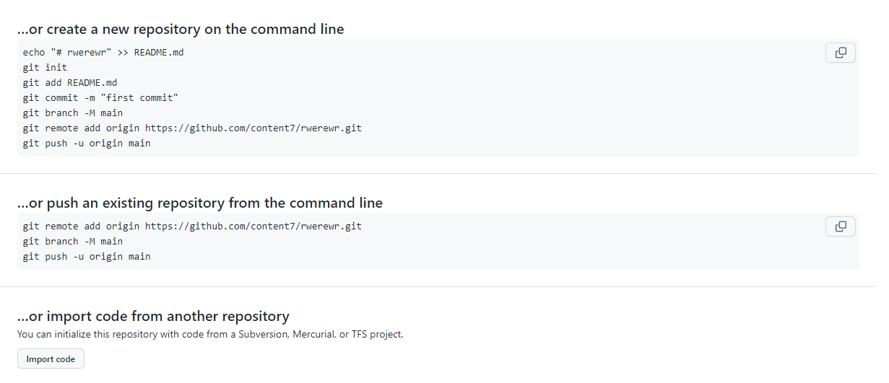

[< К содержанию](./readme.md)
___
## Передача данных в удалённый репозиторий. <br/>Команда "git push".
___

Команда ***"git push"*** позволяет выгрузить содержимое локального репозитория в удалённый репозиторий. После того как файлы были проиндексированы и был сделан коммит, с помощью данно йкоманды изменения можно загрузить в удалённый репозиторий, например на **GitHub**.

Для того чтобы впервые отправить изменения на удалённый репозиторий нужно использовать команду:
```
git push -u origin master
```

В данном случае ключ **-u** позволит запомнить путь удалённого репозитория, после чего можно будет использовать краткую команду:

```
git push
```
Команды для первичной настройки удалённого репозитория и дальнейшей работы с ним указаны на самом сайте [**GitHub**](https://github.com/) при создании репозитория.


*Источник:* [**Github.com**](https://github.com)
___
[Перейти к следующему разделу >](./gitpull.md)