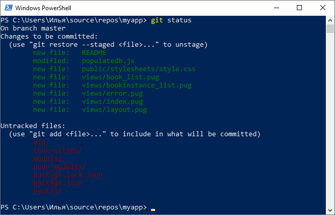

[< К содержанию](./readme.md)
___
## Просмотр состояния файлов в рабочем каталоге и индексе.<br/> Команда "git status".
___

Для того чтобы узнать текущую информацию о состоянии репозитория, необходимо воспользоваться командой ***"git status"***

```
git status
```
С помощью этой команды можно узнать о состоянии проиндексированных файлов, а также увидеть файлы, которые не отслеживаются Git. 


<sub>**Пример использования команды ***"git status"*****</sub>
___
[Перейти к следующему разделу >](./gitcommit.md)